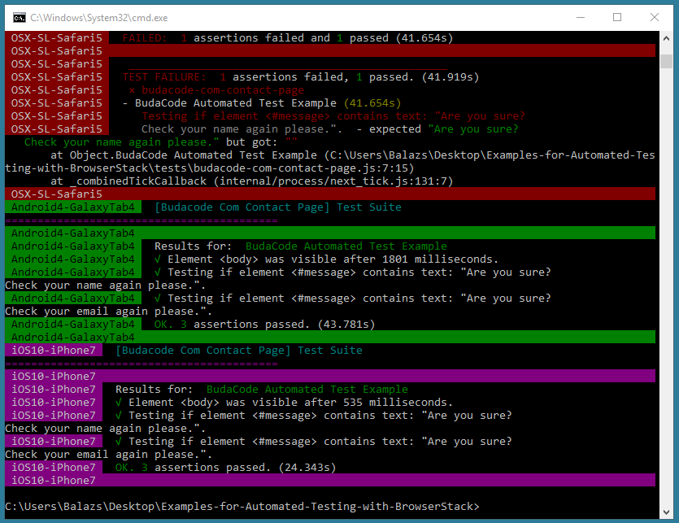
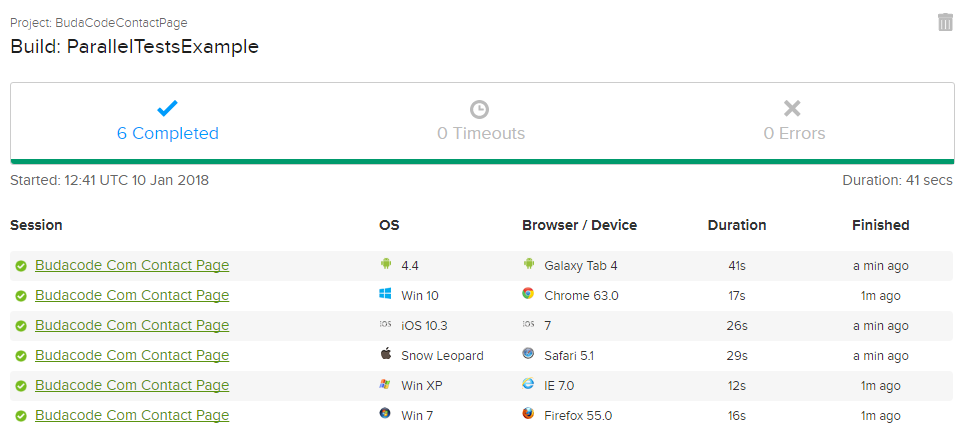

# Bevezetés
A repo két példát tartalmaz ami bemutatja hogyan lehet felhőben futtatni automatizált UI teszteket a BrowserStack segítségével.

A BrowserStack mögött a [Selenium](http://www.seleniumhq.org) van, ez a keretrendszer kommunikál a desktop böngészőkkel. Mobil böngészők és alkalmazások esetén pedig az [Appium ](http://www.appium.io), de mindkettő a  WebDriver protocolt használja és a BrowserStack egy felület nyújt minden platformhoz.

# BrowserStack account és Access Key
Regisztrálni egy free trial-ra a https://www.browserstack.com/users/sign_up címen lehet.

A szkripteket módosítsd hogy a kapott felhasználóinevet és access key-t használják  (browserstack.user és browserstack.key értékek).

# Environment set up
```bash
npm install selenium-webdriver
npm install nightwatch
```

# 1. Egyszerű browser automation példa
Ez a példa bemutatja a Selenium és BrowserStack kapcsolatát.

## browser-automation-example.js
```javascript
const { Builder, By, Key, until } = require('selenium-webdriver');

var capabilities = {
  'browserName':       'Chrome',
  'browser_version':   '63.0',
  'os':                'Windows',
  'os_version':        '10',
  'resolution':        '1280x800',
  'project' :          'BudaCodeContactPage',
  'browserstack.user': 'USERNAME',
  'browserstack.key':  'ACCESS_KEY',
  'browserstack.debug': true
};

// Elindítjuk a tesztet a BrowserStack Selenium Grid-jén
var driver = new Builder().
  usingServer('http://hub-cloud.browserstack.com/wd/hub').
  withCapabilities(capabilities).
  build();

driver.get('http://www.budacode.com/contact');

const submitButton = driver.findElement(By.id('submitForm'));
const closeButton = driver.findElement(By.id('closeModal'));

// A sleep-nek itt most csak annyi a szerepe hogy jobban követhető a felvétel
// ha van egy kis szünet a lépések között)

driver.sleep(1000);
submitButton.click();

driver.findElement(By.id('message')).getAttribute('innerHTML').then(value => {
  console.log(value);
});

driver.sleep(1000);
closeButton.click();

driver.findElement(By.id('name')).sendKeys('BrowserStack Automated Test');

driver.sleep(1000);
submitButton.click();

driver.findElement(By.id('message')).getAttribute('innerHTML').then(value => {
  console.log(value);
});

driver.sleep(3000);

// Kilépünk a tesztből
driver.quit();
```

## Run
```bash
node browser-automation-example.js
```

## Output
```bash
Are you sure? <br> Check your name again please.
Are you sure?<br> Check your email again please.
```
## BrowserStack

A https://www.browserstack.com/users/sign_in címen való bejelentkezés után lehet megnézni a részleteket a session-ről. A felső menüsorban az Automate-re kell kattintani hogy bejöjjön a felület ahol elérhetőek a felvételek és a logok.


# 2. Példa párhuzamos tesztelésre
Ez a példa bemutatja hogyan lehet több böngészőt párhuzamosan tesztelni a Nightwatch tesztelési keretrendszerrel. A tesztelendő platformok és böngészők listája ne legyen mérvadó, véletlenszerűen válogattam őket össze a példához.

## parallel.conf.js
```javascript
nightwatch_config = {
  src_folders : [ 'tests' ],
  selenium : {
    'start_process' : false,
    'host' : 'hub-cloud.browserstack.com',
    'port' : 80
  },
  common_capabilities: {
    'project':           'BudaCodeContactPage',
    'build':             'ParallelTestsExample',
    'browserstack.user': 'USERNAME',
    'browserstack.key':  'ACCESS_KEY',
    'browserstack.debug': true
  },
  test_settings: {
    default: {},
    'WindowsXP-IE7': {
      desiredCapabilities: {
        'browserName':     'IE',
        'browser_version': '7.0',
        'os':              'Windows',
        'os_version':      'XP',
        'resolution':      '1024x768'
      }
    },
    'Windows7-Firefox55': {
      desiredCapabilities: {
        'browserName':     'Firefox',
        'browser_version': '55.0',
        'os':              'Windows',
        'os_version':      '7',
        'resolution':      '1280x800'
      }
    },
    'Windows10-Chrome63': {
      desiredCapabilities: {
        'browserName':     'Chrome',
        'browser_version': '63.0',
        'os':              'Windows',
        'os_version':      '10',
        'resolution':      '1366x768'
      }
    },
    'OSX-SL-Safari5': {
      desiredCapabilities: {
        'browserName':     'Safari',
        'browser_version': '5.1',
        'os':              'OS X',
        'os_version':      'Snow Leopard',
        'resolution':      '1920x1080'
      }
    },
    'Android4-GalaxyTab4': {
      desiredCapabilities: {
        'browserName':     'android',
        'device':          'Samsung Galaxy Tab 4',
        'realMobile':      'true',
        'os_version':      '4.4'
      }
    },
    'iOS10-iPhone7': {
      desiredCapabilities: {
        'browserName':     'iPhone',
        'device':          'iPhone 7',
        'realMobile':      'true',
        'os_version':      '10.3'
      }
    }
  }
};

for(var i in nightwatch_config.test_settings) {
  var config = nightwatch_config.test_settings[i];
  config['selenium_host'] = nightwatch_config.selenium.host;
  config['selenium_port'] = nightwatch_config.selenium.port;
  config['desiredCapabilities'] = config['desiredCapabilities'] || {};

  for(var j in nightwatch_config.common_capabilities) {
    config['desiredCapabilities'][j] = config['desiredCapabilities'][j] ||
      nightwatch_config.common_capabilities[j];
  }
}

module.exports = nightwatch_config;
```

## tests/budacode-com-contact-page.js
```javascript
module.exports = {
  'BudaCode Automated Test Example': function (browser) {
    browser
      .url('http://www.budacode.com/contact')
      .waitForElementVisible('body', 1000)
      .click('button[id=submitForm]')
      .assert.containsText('#message', 'Are you sure?\nCheck your name again please.')
      .click('button[id=closeModal]')
      .setValue('input[type=text]', 'BrowserStack Automated Test')
      .click('button[id=submitForm]')
      .assert.containsText('#message', 'Are you sure?\nCheck your email again please.')
      .end();
  }
}; 
```

## Run
Paraméterrel lehet beállítani hogy melyik platformokat akarjuk tesztelni.
```bash
./node_modules/.bin/nightwatch -c parallel.conf.js -e WindowsXP-IE7,Windows7-Firefox55,Windows10-Chrome63,OSX-SL-Safari5,Android4-GalaxyTab4,iOS10-iPhone7
```
## Output

## BrowserStack
A session-ök csoportosítva jelennek meg és mindegyikről elérhetőek a részletek ugyanúgy mint az előző példában.



A zöld pipák itt a session-ök állapotát jelölik, nem a tesztek eredményét. A Nightwatch tesztek helyileg futnak, a távoli böngészős környezetet biztosítja a BrowserStack.

# Hasznos linkek

* [Running Selenium Webdriver tests with Node JS on BrowserStack](https://www.browserstack.com/automate/node)
* [BrowserStack Node JS Nightwatch Documentation](https://www.browserstack.com/automate/nightwatch)
* [Test on the right mobile devices](https://www.browserstack.com/test-on-the-right-mobile-devices)
* [Selenium WebDriver documentation]( http://seleniumhq.github.io/selenium/docs/api/javascript/module/selenium-webdriver/)
* [Nightwatch API reference](http://nightwatchjs.org/api)

